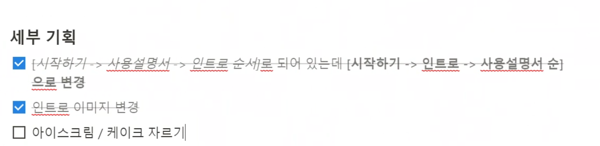

# UDAUM 회사 관련 직무 수행

***
***
***

# 회의 관련 방법론

## 결론 : 다음과 같은 방법을 제시함.

### 회의 :

- 목적 : 협업하고, 직면한 문제를 돌파하고, 긴급한 문제를 해결할 때, 다른 사람의 자료 - 정보 - 가치 및 의사결정이 필요할 때 사용. (언제? 에 대한 답이기도 함.)
- 회의 주제
    - 3가지 이내 주제.
- 회의 인원
    - 회의 주제와 관련하여, "자료나 정보(Input), 가치, 의사결정”에서 역할을 담당하는 사람만 참여.
    - 회의 주제 중, 타겟 대상 인원이 다른 경우, 회의를 분할.
        - 기여 하지 못하는 주제의 경우, 중간에 이탈.
    - 5인 이상의 미팅의 경우, 해당 인원 중 “꼭 회의에서 필요한 사람이 없지는 않은지” 체크해 볼 필요가 있음.
- 회의 시간 :
    - 30분 이내. (길어도 1시간)
- 동료들과 직접 대화 / 명확한 단어 사용.
- 개인적 판단으로, 더 ‘효율적인’ 방향으로 움직이기.
    - 단, 이에 대해 공유할 필요는 존재.

### 데일리 스크럼 :

- 목적 : 개발 팀이 스프린트 목표를 달성할 확률을 최적화 하는 것.
- 주제 :
    - 즉, 한 문장으로 “**진척도 파악 및, 장애물 파악 및 해결**”
        - 현재 상태 vs 스프린트 목표의 비교. (무엇을 했는가 / 무엇을 할 것인가)
        - 장애물을 공유해 빠른 해결.
        - 일정 기간 동안 아무 진전도 없는 작업을 Blocker 로 명명 및, 함께 해결하여 빠른 스프린트 목표 달성을 추구.
- 인원 :
    - 연관이 있는 개발팀
- 회의 시간 :
    - 10분 / 필요 시 그 이상.
- 동료들과 직접 대화 및 명확한 단어 사용

---

## 참고자료

- [일런 머스크의 '미친 생산성을 위한 6가지 법칙' | GeekNews (hada.io)](https://news.hada.io/topic?id=7860)
- [스티브 잡스가 지켰던 '회의 - 3S 미팅 원칙' | GeekNews (hada.io)](https://news.hada.io/topic?id=6420)
- [회의도, 데드라인도, 풀타임 직원도 없는 회사 | GeekNews (hada.io)](https://news.hada.io/topic?id=3559)
- [왜 당신의 일일 스탠드업 미팅은 실패하는가 | GeekNews (hada.io)](https://news.hada.io/topic?id=8352)
- [항상 그만두기 | GeekNews (hada.io)](https://news.hada.io/topic?id=4442)
- [CEO를 위한 운영 및 내부 커뮤니케이션 전략 | GeekNews (hada.io)](https://news.hada.io/topic?id=1156)
- [아마존의 도큐먼트 문화 | GeekNews (hada.io)](https://news.hada.io/topic?id=4479)
- [Agile 20주년 : 실패한 반란 | GeekNews (hada.io)](https://news.hada.io/topic?id=4788)

## 정리

- 회의 인원의 최소화 : 필요 주제에 대해 가장 필요한 사람이나, 의견을 얘기하고 - 더 좋은 아이디어를 낼 수 있는 관련자 만이 참여.
    - 참여자가 많은 미팅을 피해야 함.
- 회의 의제 : 3개 이내로 함.
- 회의 시간 : 30분 이내로.

- 논의 필요 주제에 대해, 확실하게, 자주, 짧게 이야기하는 것이 좋으나, 길고 다양한 주제에 대한 회의는 별로 좋지 않음을 역설.
    - 오히려 미팅을 자주 하지 말라고 꼬집기도 함.
    - '협업하고, 직면한 문제를 돌파하고, 긴급한 문제를 해결할 때" 사용할 것.
- 미팅에 기여하는 게 없다면 (나의 자료나 정보 / 가치 / 의사 결정을 필요로 하지 않는 경우) 미팅에 참여할 이유가 없음. **당장 나가라. 미팅을 중간에 나가는 것은 무례하지 않으며, 사람의 시간을 낭비하도록 하는 게 무례.**
- 동료들과 직접 대화하기. 빠른 소통 / 빠른 의사 결정의 우위.
- 명확한 단어 사용.

- 사규를 따르지 않아도 되며, 원칙을 따르는 것이 중요.
    - 말이 안 되거나
    - 일을 진행할 때 도움이 안 되거나
    - 특정 상황에 맞지 않는 경우.
    
- Slack 만을 이용하는 것. 분기별 목표보다는 하나의 목표. 무자비한 우선순위를 하지 않도록 함.

- 일일 스탠드업 미팅은 보통 다음과 같은 질문으로 이루어짐
    - 어제 무엇? 오늘 무엇? 막히는 부분?
- 단, 이것의 진짜 목표는 개발 팀이 스프린트 목표를 달성할 확률을 최적화 하는 것.
- 스프린트 목표를 달성하는데 우려되는 사항이나 장애물에 대해 이야기하는 시간. 블로커가 보고되지 않았는데, 목표 달성에 실패했다면 데일리 스크럼이 잘못 이루어지고 있는 것.
    - 현재 상태 vs 스프린트 목표의 비교.
    - 장애물을 공유해 빠른 해결
    - 일정 기간 동안 아무 진전도 없는 작업을 Blocker 라 함.
- 데일리 스탠드 업은 개발 팀에서 필요한 것. 오너를 참가 시킬 필요가 없음.

애자일

“공정과 도구(processes and tools)보다 개인과 상호작용(Individuals and interactions)을

- 포괄적인 문서(comprehensive documentation)보다 작동하는 소프트웨어(Working software)를
- 계약 협상(contract negotiation)보다 고객과의 협력(Customer collaboration)을
- 계획을 따르기(following a plan)보다 변화에 대응하기(Responding to change)를

가치 있게 여긴다. 이 말은, 왼쪽에 있는 것들도 가치가 있지만, 우리는 오른쪽에 있는 것들에 더 높은 가치를 둔다는 것이다."

- 회의를 자주하는 것은 Scrum Meeting 으로서의 의미를 가짐. 합리적이거나 효율적이지 않은 긴 미팅은 시간 낭비.