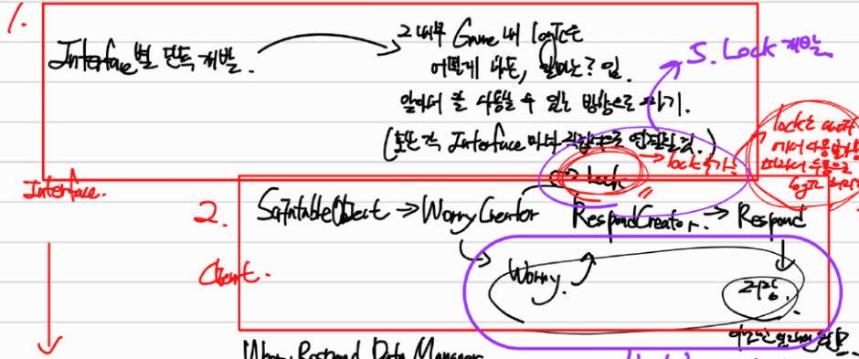
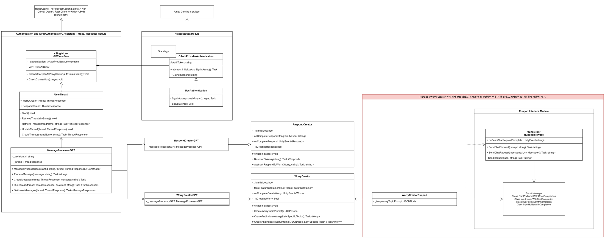
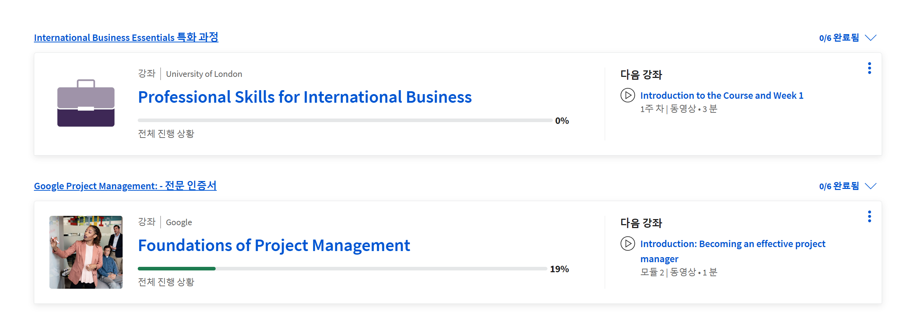

# LLM - 파란학기 프로젝트

- 리팩토링 : 
    1. OpenSource LLM Check
    2. Respond Creator, Worry Creator Class 통합 (Refactoring)
    3. 현재 구조 기반 추가 개선점 분석.
        - 결론 : API Server / Modulized Feature 부분 / Client 부분 ⇒ 이렇게 별도로 존재.
            1. 또한, Modulized Feature 부분은 현재 각 API Server 마다 호출하여 받는 방식이 달라 통일 시킬 수 없으므로, 통일하지 않는 게 맞음.
            2. 또한 Message Processor Class 는 Modulized Feature (Interface)에 두는 것이 맞음. 설령, Client 부분으로 둔다고 하더라도, 각 Message Processor Class 가 각 Modulized Feature 와 연결되어야 하므로, 그냥 이런 형식으로 두는 게 더 나음. 
            
    4. Respond Creator, Worry Creator Class 에 Lock 기능 추가. → 고민 생성 중, 고민 생성 요청 중복을 막는 기능
    5. Worry 와 Respond 를 관리하고, 이를 Server 와 연동하는 WorryRespondDataManager 를 제작.
    

- 기능 테스트 : 
    1. Testor Class Test 잘 되는 것 확인.
    2. WorryCreator & Respond Creator Flow 잘 되는 것 확인.
    3. Data Manager 전송 : Unity Cloud Save가 잘 안 되는 것을 확인. SimpleJson 이 Unity의 JsonUtility 를 이용하여 Serializalbe 될 때 발생하는 문제와, Unity Cloud Save 자체가 업데이트 되며 다른 함수를 사용하여야 하는 것을 확인 및 수정.

# 문서 기록 방법 변경

- 평소 Obsidian 을 통해 문서를 기록 및, PDF 를 통해 Export 하였음. 하지만, Export 한 PDF 의 가독성 등이 너무 떨어졌고, 이에 따라 다른 방법에 대해 탐색(https://publish.obsidian.md/pavdup-second-brain/2.+%ED%99%9C%EB%8F%99+%2B+%EC%B0%BD%EC%9E%91/Writing/Obsidian/000.+Permanent/Obsidian+Publish) 해당 링크의 탐색 과정처럼, Obsidian Publish 기능을 이용하는 것으로 결론 내림. 하지만, 기존 문서 중 민감한 자료를 가진 문서가 있을 가능성이 있어, 전체 문서 게시가 아닌, 필요 문서만 공유할 것을 생각함.

- 앞으로 PDF 문서를 첨부하는 것이 아닌, 링크를 통해 첨부할 것.

# PM 직군

- 원래 "알고리즘, 디자인 패턴 + 리팩토링 학습, 복습 (DOWN-TOP)" 을 진행할 예정이었고, 알고리즘에 대해 종만북, 리팩토링에 대해 리팩토링 도서를 읽어나가는 중이었으나, 개인적 생각에 따라 STEM - CS (Game Client & Graphics) 뿐만 아닌 Liberal Arts - Design (스토리텔링, 게임 플레이 디자인, PM)도 강한 열망을 갖고 있음을 느낌.
- 이 중에서도 PM 에 현재 깊게 관심이 가, 메인 기획 및 PM 역할로 참여가 가능한 프로젝트에 참여 => 공포 게임 프로젝트
- Project Managing 관련 업무 습득을 위해 Coursera 에 다음과 같은 과목들을 신청 